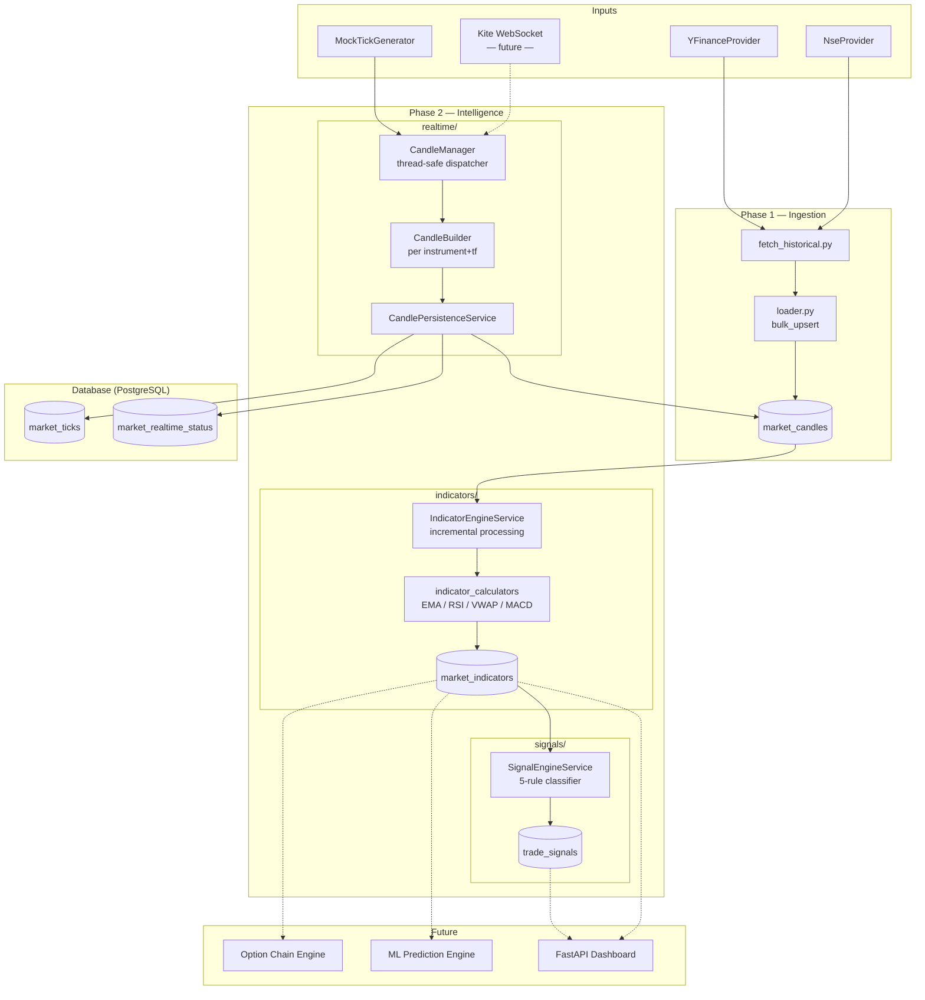
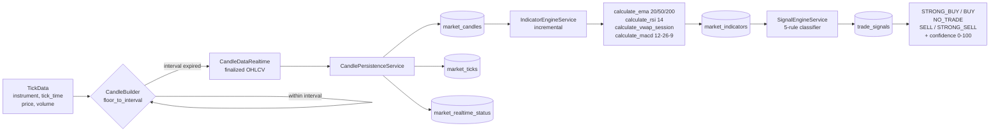
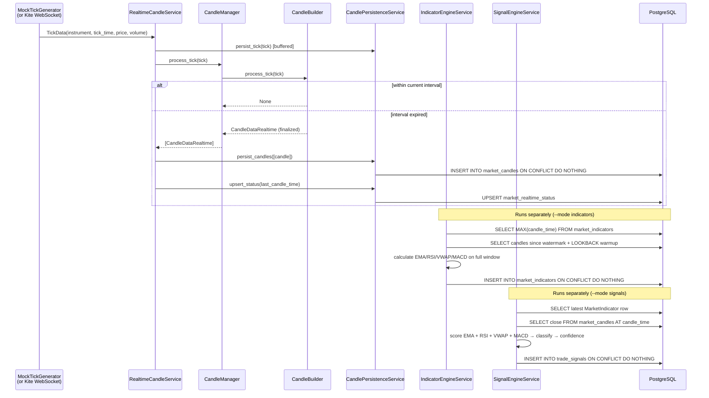

# Market AI — Phase 2 Architecture

## Overview

Phase 2 adds three new capabilities on top of Phase 1's historical data ingestion:

| Module | Purpose |
|---|---|
| `realtime/` | Convert tick streams into OHLCV candles in-memory |
| `indicators/` | Incrementally calculate EMA, RSI, VWAP, MACD |
| `signals/` | Rule-based trade signal generation with confidence scoring |
| `scheduler/` | Service orchestration, mock tick generator, historical replay |

---

## Component Diagram



---

## Data Flow Diagram



---

## Sequence Diagram — Realtime Tick Processing



---

## Confidence Scoring Model

```
Signal confidence = clamp(50 + Σ(component_scores) / 2, 0, 100)

Component scores (signed):
┌───────────────────────────────────────────┬──────┬──────┬──────┬───────┐
│ Condition                                 │ Bull │ Mild │ Flat │ Bear  │
├───────────────────────────────────────────┼──────┼──────┼──────┼───────┤
│ EMA20>50>200 (full alignment)             │  +30 │  +15 │    0 │  -30  │
│ RSI > 60 / > 55 / 45-55 / < 45 / < 40   │  +20 │  +10 │    0 │  -20  │
│ Price vs VWAP                             │  +20 │   —  │    0 │  -20  │
│ MACD vs Signal (strong / weak)            │  +30 │  +15 │    0 │  -30  │
└───────────────────────────────────────────┴──────┴──────┴──────┴───────┘

STRONG_BUY example: +30 +20 +20 +30 = 100 raw → confidence = min(100, 50+50) = 100
BUY example:        +15 +10 +20  +0 = 45 raw  → confidence = 50+22 = 72
NO_TRADE:           RSI 45-55 OR EMA bullish but MACD bearish (conflict)
```

---

## Signal Rule Set

| Signal | Conditions |
|---|---|
| **STRONG_BUY** | EMA20 > EMA50 > EMA200 AND RSI > 60 AND Price > VWAP AND MACD > Signal |
| **BUY** | EMA20 > EMA50 AND RSI > 55 AND Price > VWAP |
| **STRONG_SELL** | EMA20 < EMA50 < EMA200 AND RSI < 40 AND Price < VWAP AND MACD < Signal |
| **SELL** | EMA20 < EMA50 AND RSI < 45 AND Price < VWAP |
| **NO_TRADE** | RSI in [45, 55] OR indicators conflict (e.g., bullish EMA + bearish MACD) |

---

## Incremental Indicator Processing

```
market_candles                    market_indicators
     │                                  │
     │  SELECT MAX(candle_time)         │
     │◄─────────────────────────────────┘
     │
     │  last_indicator_time = 2024-01-15 (watermark)
     │
     │  LOOKBACK warmup (250 rows ≤ watermark):
     │  [2023-05-..., ..., 2024-01-15]
     │
     │  New rows (> watermark):
     │  [2024-01-16, 2024-01-17, ...]
     │
     ▼
  full DataFrame (warmup + new)
     │
     ▼  calculate EMA/RSI/VWAP/MACD on full window
     │  (warmup rows seed EMA correctly)
     │
     ▼  filter: candle_time > last_indicator_time
     │
     ▼  INSERT INTO market_indicators ON CONFLICT DO NOTHING
```

---

## Database Schema

```sql
-- Phase 1 (existing)
market_candles (id, instrument, candle_time, open, high, low, close, volume, timeframe)
  UNIQUE (instrument, candle_time, timeframe)
  INDEX  (instrument, timeframe, candle_time)

-- Phase 2 (new)
market_ticks (id, instrument, tick_time, price, volume)
  INDEX (instrument, tick_time)

market_realtime_status (id, instrument, timeframe,
                        last_tick_time, last_candle_time,
                        last_indicator_time, last_signal_time,
                        status, updated_at)
  UNIQUE (instrument, timeframe)

market_indicators (id, instrument, candle_time, timeframe,
                   ema20, ema50, ema200, rsi14, vwap, macd, macd_signal, created_at)
  UNIQUE (instrument, candle_time, timeframe)
  INDEX  (instrument, timeframe, candle_time)

trade_signals (id, instrument, signal_time, timeframe,
               signal_type, confidence, reason, created_at)
  UNIQUE (instrument, signal_time, timeframe)
  INDEX  (instrument, signal_time)
```

---

## Run Commands

```bash
# Prerequisites: Phase 1 data already ingested
# docker compose up -d && python main.py --months 6 --timeframes 1day

# Install Phase 2 dependencies
pip install pandas-ta numpy pytest pytest-mock

# Calculate indicators (incremental — safe to re-run)
python main.py --mode indicators --timeframes 1day

# Generate trade signals
python main.py --mode signals --timeframes 1day

# Both in sequence
python main.py --mode pipeline --timeframes 1day

# Historical replay through candle builder
python main.py --mode replay --months 1 --timeframes 1day,5min

# Run all tests
pytest tests/ -v

# Unit tests only (no database required)
pytest tests/unit/ -v

# Integration tests (requires Docker PostgreSQL)
pytest tests/integration/ -v
```

---

## Future Integration Points

### Kite Connect WebSocket
```python
# kite_feed.py (new file — no existing code changes needed)
class KiteTickGenerator:
    def __init__(self, kite_client, instruments):
        self._kite = kite_client
        self._service = RealtimeCandleService(...)

    def on_ticks(self, ws, ticks):
        for raw in ticks:
            tick = TickData(
                instrument=raw["instrument_token"],
                tick_time=raw["timestamp"],
                price=Decimal(str(raw["last_price"])),
                volume=raw["volume"],
            )
            self._service.process_tick(tick)  # ← existing, unchanged
```

### Option Chain Engine
```
New module: option_chain/
  Reads: market_candles + market_indicators for underlying (NIFTY/BANKNIFTY)
  New table: market_option_chain (strike, expiry, ce_oi, pe_oi, ce_iv, pe_iv, ...)
  Signal enrichment: PCR (Put-Call Ratio) + Max Pain → adjusts signal confidence
```

### AI Prediction Engine
```
New module: ml/
  Feature matrix: market_indicators (EMA ratios, RSI, MACD histogram)
  Label: trade_signals.signal_type (converted to multi-class)
  Models: LightGBM (tabular) / LSTM (sequence)
  Output: predicted_signals table with ML confidence scores
```

### FastAPI Dashboard (.NET / React compatible)
```
New module: api/
  GET /api/signals?instrument=NIFTY+50&timeframe=1day&limit=10
  GET /api/indicators?instrument=NIFTY+50&timeframe=1day
  GET /api/candles?instrument=NIFTY+50&timeframe=5min&from=2024-01-01
  WebSocket /ws/live  ← streams signals as they are generated
```
