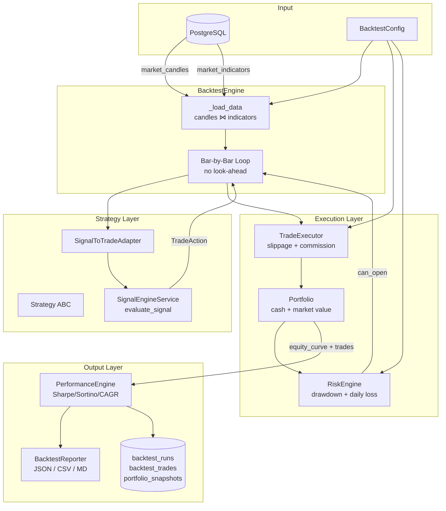
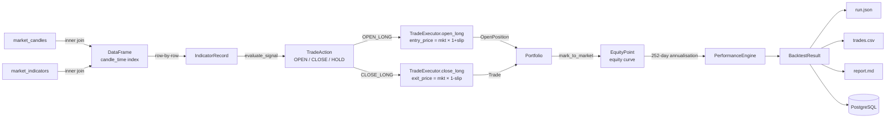
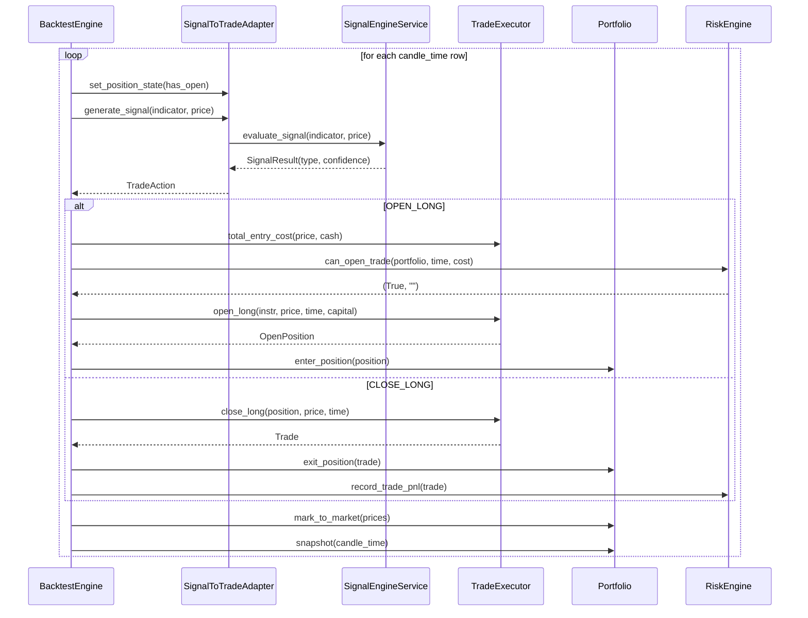

# Phase 3 — Backtesting Framework Architecture

## Overview

The backtesting framework simulates a strategy over historical data without look-ahead bias. It processes market candles chronologically, applies an indicator-driven strategy, executes trades with realistic costs, tracks portfolio state, and computes institutional-grade performance metrics.

---

## Component Diagram



---

## Data Flow Diagram



---

## Sequence Diagram — Single Bar Processing



---

## Module Reference

| Module | Responsibility |
|---|---|
| `backtesting/backtest_models.py` | All domain dataclasses: `BacktestConfig`, `Trade`, `OpenPosition`, `EquityPoint`, `BacktestResult` |
| `backtesting/strategy_base.py` | `Strategy` ABC — `generate_signal()`, `on_backtest_start/end()` |
| `backtesting/strategy_signal_adapter.py` | Wraps `SignalEngineService`; converts `SignalResult` → `TradeAction` |
| `backtesting/trade_executor.py` | Applies slippage + commission model; computes entry/exit prices and PnL |
| `backtesting/portfolio.py` | Tracks cash, market value, equity, unrealized/realized PnL, drawdown |
| `backtesting/risk_engine.py` | Enforces max_open_trades, max_drawdown, cash sufficiency, max_daily_loss |
| `backtesting/performance.py` | Computes Sharpe, Sortino, CAGR, max drawdown, win rate, profit factor, streaks |
| `backtesting/backtest_engine.py` | Orchestrates the full run; loads data, iterates bars, persists results |
| `backtesting/reporting.py` | Generates JSON, CSV, Markdown reports |
| `database/models_backtesting.py` | ORM: `BacktestRun`, `BacktestTrade`, `PortfolioSnapshot` |

---

## Cost Model

| Cost | Formula |
|---|---|
| Entry price (LONG) | `market_price × (1 + slippage_pct)` |
| Exit price (LONG) | `market_price × (1 - slippage_pct)` |
| Entry commission | `entry_price × quantity × commission_pct` |
| Exit commission | `exit_price × quantity × commission_pct` |
| Gross PnL | `(exit_price − entry_price) × quantity` |
| Net PnL | `gross_pnl − entry_commission − exit_commission − entry_slippage − exit_slippage` |

Default parameters: `commission_pct = 0.0003` (3 bps), `slippage_pct = 0.0005` (5 bps).

---

## Performance Metrics

| Metric | Method |
|---|---|
| Total Return % | `(ending − starting) / starting × 100` |
| CAGR % | `(ending/starting)^(1/years) − 1` |
| Max Drawdown % | Rolling peak: `max((peak − equity) / peak × 100)` |
| Sharpe Ratio | `(mean_daily_ret − daily_rf) / std × √252` |
| Sortino Ratio | `(mean_daily_ret − daily_rf) / downside_std × √252` |
| Calmar Ratio | `CAGR / max_drawdown` |
| Recovery Factor | `total_return / max_drawdown` |
| Profit Factor | `sum(winning_gross_pnl) / sum(abs(losing_gross_pnl))` |
| Expectancy | `win_rate × avg_winner + (1 − win_rate) × avg_loser` |

Annualization: **252 trading days** (NSE).  
Risk-free rate: **6.5% p.a.** (India 10yr G-Sec proxy), daily = `0.065 / 252`.

---

## Database Schema

```sql
-- Run summary (one row per backtest run)
CREATE TABLE backtest_runs (
    id               BIGSERIAL PRIMARY KEY,
    run_name         VARCHAR(200) NOT NULL,
    strategy_name    VARCHAR(100) NOT NULL,
    instrument       VARCHAR(50)  NOT NULL,
    timeframe        VARCHAR(20)  NOT NULL,
    start_date       TIMESTAMP    NOT NULL,
    end_date         TIMESTAMP    NOT NULL,
    starting_capital FLOAT        NOT NULL,
    ending_capital   FLOAT        NOT NULL,
    total_return_pct FLOAT,
    max_drawdown_pct FLOAT,
    win_rate_pct     FLOAT,
    sharpe_ratio     FLOAT,
    created_at       TIMESTAMP    DEFAULT NOW()
);

-- Individual trade records
CREATE TABLE backtest_trades (
    id              BIGSERIAL PRIMARY KEY,
    run_id          BIGINT REFERENCES backtest_runs(id) ON DELETE CASCADE,
    instrument      VARCHAR(50),
    entry_time      TIMESTAMP,
    exit_time       TIMESTAMP,
    entry_price     FLOAT,
    exit_price      FLOAT,
    quantity        INTEGER,
    side            VARCHAR(10),
    gross_pnl       FLOAT,
    net_pnl         FLOAT,
    commission      FLOAT,
    slippage        FLOAT,
    holding_minutes INTEGER
);

-- Equity curve snapshots (one per bar processed)
CREATE TABLE portfolio_snapshots (
    id              BIGSERIAL PRIMARY KEY,
    run_id          BIGINT REFERENCES backtest_runs(id) ON DELETE CASCADE,
    snapshot_time   TIMESTAMP,
    cash            FLOAT,
    equity          FLOAT,
    unrealized_pnl  FLOAT,
    realized_pnl    FLOAT,
    drawdown_pct    FLOAT
);
```

---

## CLI Usage

```bash
# Run backtest with default parameters (last 12 months, capital 10L, signal strategy)
python main.py --mode backtest --instruments "NIFTY 50" --timeframes 1day

# Specify date range and capital
python main.py --mode backtest \
    --instruments "NIFTY 50" --timeframes 1day \
    --from-date 2023-01-01 --to-date 2024-01-01 \
    --capital 500000

# Custom run name (appears in DB and report filenames)
python main.py --mode backtest \
    --instruments "NIFTY BANK" --timeframes 5min \
    --capital 2000000 \
    --run-name "niftybank_5min_2023"
```

Reports are written to `reports/` directory:
- `reports/{run_name}.json` — full metrics + equity curve sample
- `reports/{run_name}_trades.csv` — all trade records
- `reports/{run_name}.md` — human-readable summary

---

## Risk Controls

| Control | Default | Config Field |
|---|---|---|
| Max simultaneous positions | 1 | `max_open_trades` |
| Max portfolio drawdown | 15% | `max_drawdown_pct` |
| Max daily loss | 2% of equity | `max_daily_loss_pct` |
| Position size | 10% of capital | `position_size_pct` |

When any risk limit is breached the engine skips the trade and logs the reason at DEBUG level. Trading resumes on the next bar once conditions are met (drawdown limits are permanent halts for the session).

---

## Extensibility

### Adding a New Strategy

1. Subclass `backtesting.strategy_base.Strategy`
2. Implement `generate_signal(indicator_row, current_price) -> TradeAction`
3. Register in `BacktestEngine._build_strategy()`:
   ```python
   if name == "my_strategy":
       return MyStrategy()
   ```
4. Run: `python main.py --mode backtest --strategy my_strategy`

### Adding New Indicators

The engine reads all columns from `market_indicators` into `IndicatorRecord`. To add a new indicator:
1. Add the column to `MarketIndicator` ORM model
2. Calculate it in `IndicatorEngineService`
3. Add the field to `IndicatorRecord` dataclass
4. Use it in your custom `Strategy.generate_signal()` implementation

---

*Generated: Phase 3 — Market AI Backtesting Framework*
